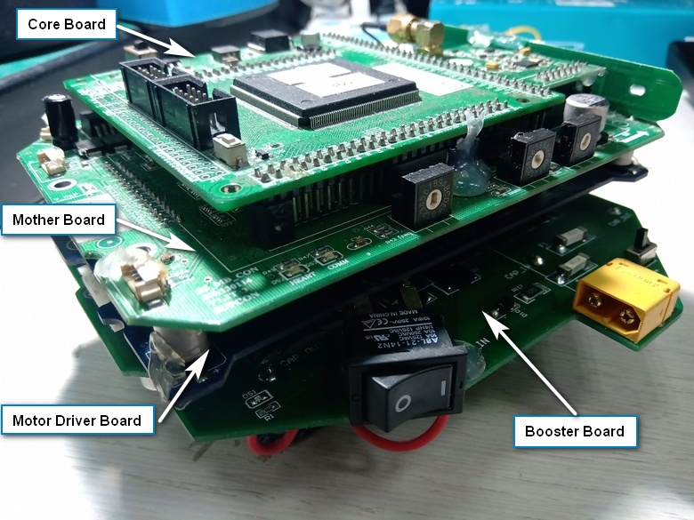
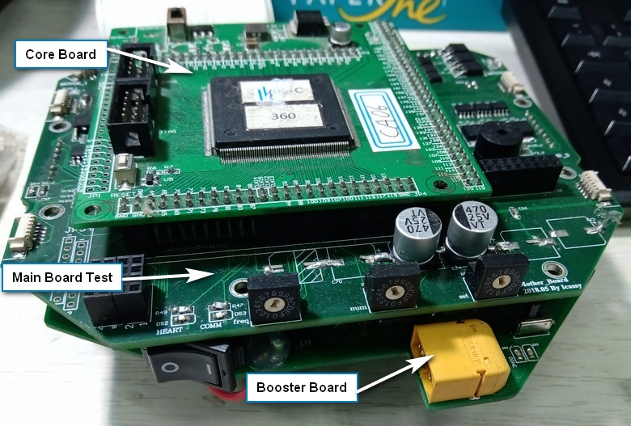

# Electronics

 ZJUNlict Electronics Design for the Robocup Soccer Small-Size League https://zjunlict.cn/
 

The electronics design covers the overall control of the hardware based on a team's strategy program. The detailed tasks for the electronics include driving motors, wireless communication, charging and discharging capacitors for shooting and chipping. 

There are three configurations of electrical systems shown in the Table below currently used in ZJUNlict robots. 

The single Cyclone III FPGA configuration was adopted since 2012 and explained in [2013 and 2014 champion papers](https://zjunlict.cn/?page_id=54). The FPGA handles both motor control and other tasks such as communication and motion sensor fusion based on embedded Nios II processor. 

The micro-controller STM32F407 was added to take over tasks other than motor control since late 2017 described in [2018 ETDP](https://zjunlict.cn/?page_id=54). 

Since 2018, a single micro-controller STM32H743 capable of operation frequency up to 400MHz combined with five BLDC controller Allegro A3930 was able to handle all the tasks. (Based on [Team Tiger's Opensourced Design](https://tigers-mannheim.de/index.php?id=65))

Other improvements include increasing each encoder's counts per revolution (CPR) to increase motor low-speed control performance, implementation of the accelerometer and compass to achieve more accurate motion tracking and switching to nRF24L01+ wireless IC to deliver higher bandwidth communication with better signal sensitivity.

Please check the intrested board design and related firmware shown in the following table. The archive of all the opensourced repositories can be found on [our website](https://zjunlict.cn/?page_id=54).

|                            | Since 2012           | Since 2017                       | Since 2018 |
|----------------------------|----------------------|----------------------------------|------------|
| Robot Configurations       | [Core Board](https://github.com/ZJUNlict/Core_Board)           | [Core Board FPGA & STM32](https://github.com/ZJUNlict/Core_Board_FPGA_STM32)          | [Main Board](https://github.com/ZJUNlict/Main_Board) |
|                            | [Core Board Firmware](https://github.com/ZJUNlict/Firmware_for_Core_Board)  | [Core Board FPGA & STM32 Firmware](https://github.com/ZJUNlict/Firmware_for_Core_Board_FPGA_STM32) |         [Main Board Firmware](https://github.com/ZJUNlict/Firmware_for_Main_Board)   |
|                            | [Mother Board](https://github.com/ZJUNlict/Mother_Board)         | [Main Board Test](https://github.com/ZJUNlict/Main_Board_Test)                  |   (Combined into Main Board)  |
|                            | [Motor Driver Board](https://github.com/ZJUNlict/Motor_Driver_Board)   | (Combined into Main Board Test)                    |    (Combined into Main Board)        |
|                            | [Booster Board](https://github.com/ZJUNlict/Booster_Board)        |     (Same)                   |     (Same)       |
|                            |                      |                                  |            |
| Transmitter Configurations | [Transmitter](https://github.com/ZJUNlict/Transmitter)          | [Network Transmitter](https://github.com/ZJUNlict/Network_Transmitter)              |            |
|                            | [Transmitter Firmware](https://github.com/ZJUNlict/Firmware_for_Transmitter) | [Network Transmitter Firmware](https://github.com/ZJUNlict/Firmware_for_Network_Transmitter)     |            |
|                            |                      |                                  |            |
|  Communication Protocols   |                      |                                  | [Protocol V2018](https://github.com/ZJUNlict/Wireless_Communication_Protocol) |
|                            |                      |                                  |   |

The combination of boards on a robot since 2012 is shown in the photo below.

The combination of boards since late 2017 is shown in the photo below.

The combination of boards since late 2018 which is currently under testing is shown in the photo below.

All of the boards are designed using [Altium Designer](https://www.altium.com/altium-designer/).

The details of how to use the firmware can be found in each firmware's repository.

All of the boards and related instructions are opensourced under [CC BY-NC-SA 4.0 (Attribution-NonCommercial-ShareAlike 4.0 International)](https://creativecommons.org/licenses/by-nc-sa/4.0/).

And all related firmware are opensourced under [CC BY-NC-SA 2.0(Attribution-NonCommercial-ShareAlike 2.0 Generic)](https://creativecommons.org/licenses/by-nc-sa/2.0/) except for source code created by STMicroelectronics.  

 This work is licensed under a <a rel="license" href="http://creativecommons.org/licenses/by-nc-sa/4.0/">Creative Commons Attribution-NonCommercial-ShareAlike 4.0 International License</a>
